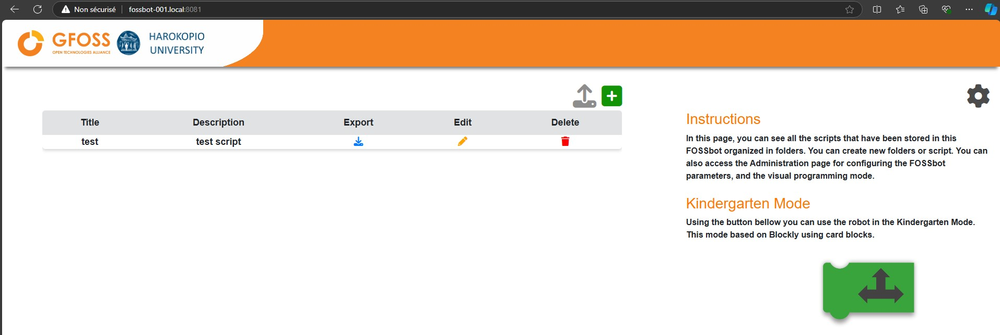

# Editor

Let’s learn how to access the FOSSBot program editor and start working on your projects!

## Getting Started

Before we dive into the editor, make sure your FOSSBot is powered on and connected to the same Wi-Fi as your computer. If you haven't set up the Wi-Fi yet, check the [Wi-Fi Setup page](first-setup.md) for help.

### Accessing the Robot Interface

To control and program your FOSSBot, you'll need to access the robot's web interface from your computer. Here's how:

1. **Power On the Robot**
   - Turn on your FOSSBot, and it will automatically connect to your Wi-Fi.  
   - If it doesn’t, no worries! Head over to the [Wi-Fi Setup page](first-setup.md) to resolve this.

2. **Open the Web Interface**
   - On your computer (connected to the same Wi-Fi as the robot), open Chrome or Firefox.
   - In the address bar, type:  
     `http://fossbot-000.local:8081`  
     *(Remember, the "000" part is unique to your robot.)*

   

Once you’ve accessed the page, you’re ready to interact with your robot!

!!! failure
    If that address doesn’t work, it might be because your router doesn’t recognize the robot by name. In that case, check your router’s admin page to find the robot’s IP address and type it into the browser like this:  
    `http://192.168.1.xxx:8080`.
    You may want to reach an IT Expert to find out the robot IP adress. It's easy to spot using a network analyzer app.

---

## The Project Management Page

Now that you’re connected to the robot’s interface, you’ll see the **Project Management** page. This is where all the programming magic happens.

- **Manage Projects**: Here, you can create, rename, and delete Blockly programming projects. All your projects are stored inside the robot, so you can easily access them anytime.
- **Start New Projects**: You can create a new project to start fresh, and the editor will open up with a blank workspace where you can start dragging and dropping blocks to control your FOSSBot.

---

## Troubleshooting Access

If you’re having trouble accessing the robot’s interface:

- **Check the Robot’s Connection**: Ensure your robot is turned on and connected to the same Wi-Fi as your computer. If the robot isn’t responding to the URL (`http://fossbot-000.local:8081`), it might not be connected to your network.
  
- **Robot Back in Setup Mode?**: If the robot’s Wi-Fi access point (fossbot-xxx) shows up on your phone or computer, it means the robot has returned to setup mode because it couldn’t connect to the network you previously configured. Follow the [Wi-Fi Setup guide](first-setup.md) to reconnect it.

---

## Next Steps

Now that you're connected to the robot and can manage your programming projects, the next step is to start building your own programs using Blockly! Head over to the [Programming Guide](programming.md) to learn how to get started with block-based programming for FOSSBot.
