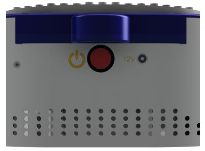
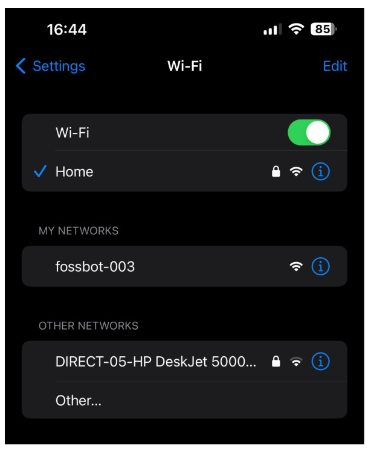
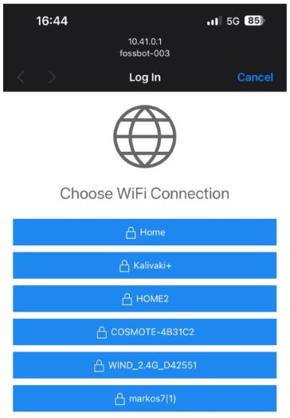
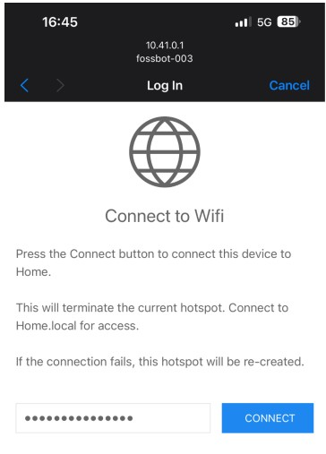
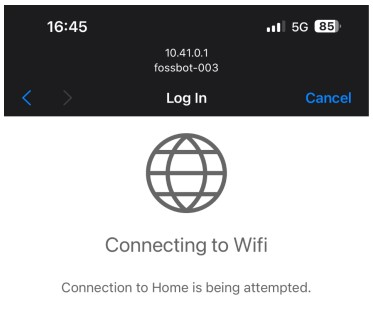

# Wi-Fi setup

Welcome !
Let's get your FOSSBot connected to Wi-Fi so you can control it from any computer on your network. 
Don’t worry, we’ll walk you through everything.

## Power On

Before we dive into Wi-Fi setup, we beed ti start the robot. Power ON the robot by pressing the red power button. 
All the LEDs will light up, and the robot will take a few minutes to initialize (usually 30s to 2min).
  

---

## Setting the WiFi settings

Fossbot don't know you're WiFi settings yet. We have to set the WiFi SSID and password manually. To do this, the robot will broadcast a Wifi access point that you can use to access the initial setup page. Each time you're fossbot move to a new location, it will get into this mode.

### 1. Find the Robot’s Wi-Fi open network

- Grab your phone and open the Wi-Fi settings.
- Look for a network named **fossbot-xxx** (the "xxx" is a unique number for your robot).

   {.img-medium}

!!! failure
    If you don’t see the network right away, give it a few seconds and try again. If it still doesn't show up, try to power off and on.

---

### 2. Connect to the Robot’s Wi-Fi
   - Select the **fossbot-xxx** network on your phone or tablet.
   - A pop-up will appear, allowing you to select your home Wi-Fi network.

   If the pop-up doesn’t appear automatically, you can open a browser and go to:  
   `http://10.41.0.1/`

---

### 3. Enter Wi-Fi Credentials
   - Choose your Wi-Fi network from the list and enter your network’s name (SSID) and password.
   - Tap **Connect** to finish the setup.

 

---

### 4. Confirm Connection
   - Once connected, your robot will remember this network for future use.
   - The FOSSBot access point (fossbot-xxx) will disappear, and your robot is now on your home (or school) Wi-Fi.

   

!!! info
    If you ever change locations or Wi-Fi networks, just repeat these steps to connect to a new network.

!!! success
    That’s it! You’ve connected your FOSSBot to Wi-Fi and are ready to explore everything it can do. If you ever need to adjust settings, look for the **cog icon** on the top-right of the robot’s home screen.

    Have fun experimenting with FOSSBot!

---

## Troubleshooting & FAQ

Here are some quick fixes for common issues:

**Can’t find the robot’s network on your phone?**  
- Restart the robot and wait a few seconds for the Wi-Fi network to appear.

**The pop-up screen disappeared. What now?**  
- Open Chrome on your phone and go to: `http://10.41.0.1/`

**Can’t access `http://fossbot-000.local:8081` after setup?**  
- Your router may not recognize the robot by name. Check your router’s admin page for the robot’s IP address, and use it instead (e.g., `http://192.168.1.xxx:8080`).

