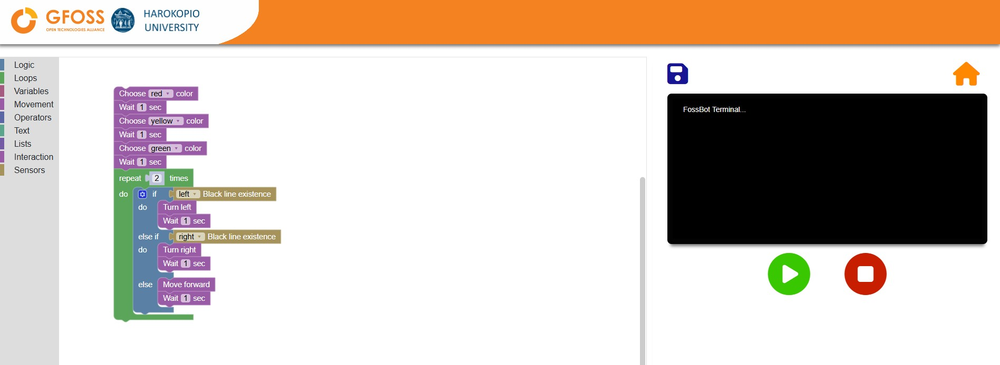

# Programming

## 1. What is Blockly?

Blockly is a super easy way to program your FOSSBot without having to write any code. Instead of typing commands, you’ll use **blocks** — colorful puzzle-like pieces that fit together. Each block represents a different command or action, and when you snap them together, you’re building a program.

This makes Blockly perfect for beginners! You can start creating your own programs right away without worrying about complicated code.

### Why Blockly is Awesome for FOSSBot

- **No code needed**: You don't have to know programming languages. Just drag, drop, and connect blocks.
- **Instant feedback**: When you build a program, you can see the robot move and react right away.
- **Fun and creative**: With Blockly, you can experiment with different actions and behaviors, like making FOSSBot move, play sounds, and respond to obstacles.

### FOSSBot-Specific Blocks

FOSSBot has its own set of special blocks designed to control the robot’s unique features. Some of these blocks let you:

- **Move the robot** forward or backward.
- **Turn** the robot left or right.
- **Control the LEDs** and change their colors.
- **Interact with sensors** to detect obstacles, light levels, and more.

You’ll soon be able to use all these blocks to create your own custom programs!
To start programming your FOSSBot, you’ll need to access the Blockly editor. If you don't know how to get on the following page, please check out this [Tutorial](editor.md)

---

## 2. **Understanding the Blockly Interface**

Now that you’re in the Blockly editor, let’s get familiar with the different parts of the interface. This will help you quickly find the blocks you need and start building programs.

---
{align=left .img-small}

 
 

### Block Toolbox

On the left side of the screen, you’ll see the **Block Toolbox**. This is where all the action happens! The toolbox contains categories of blocks that you can use to control FOSSBot. Think of it like your toolkit for building programs — each block is a command or instruction for the robot.

Let’s go through the key categories of blocks that you’ll be using.

 
 

---

### Logic

The **Logic** blocks let you control the flow of your program by making decisions. These blocks are essential for creating programs that can react to different situations.

For example, you can tell the robot, *“If there’s an obstacle in front of me, stop moving”* by using an **if** block.

---

### Loops

The **Loops** category is where you’ll find blocks that allow the robot to repeat actions. If you want FOSSBot to do something over and over (like moving forward for 5 seconds), loops are your go-to.

You can create:
- **Repeat loops** to repeat an action a set number of times.
- **While loops** to keep repeating as long as a certain condition is true.

---

### Variables

Variables let you store and reuse data, like numbers or sensor readings. In the **Variables** category, you’ll create **custom variables** to control aspects of your program.

For example, you can create a variable called `distance` to store how far the robot should move.

---

### Operators

The **Operators** category provides blocks that help you do math and compare values. Need to add two numbers together? Or check if one value is greater than another? Operators have got you covered.

These blocks are especially useful when you’re working with **sensors** or **variables** and want to make decisions based on values.

---

### Text

The **Text** blocks allow you to work with strings (i.e., sequences of characters like words or sentences). You can use these blocks to create messages, display text, or send commands.

For example, you can use a text block to display a message like *“Obstacle detected!”*.

---

### Lists

**Lists** are collections of data, and the **Lists** blocks let you manage them. Think of a list as a group of items, like a shopping list or a list of sensor readings.

With lists, you can:
- **Create a list** of values (e.g., distances the robot should move).
- **Access or modify items** in the list.

---

### Movement

The **Movement** category is all about controlling FOSSBot’s motors. These blocks allow you to make the robot move forward, backward, turn, or stop.

You’ll find blocks for:

- Moving a specific distance (e.g., move forward for 10 cm).
- Turning right or left (90 degrees or continuously).
- Stopping the robot at any point in your program.

---

### Interaction

The **Interaction** category helps you control the robot’s non-movement features, like:

- **Playing sounds** through the robot’s speaker.
- **Changing the LED color**.
- **Waiting** for a set amount of time (useful for adding delays in your program).

---

### Sensors

FOSSBot has sensors to help it interact with the world around it. In the **Sensors** category, you’ll find blocks that allow you to read data from these sensors.

For example, you can:
- Use the **distance sensor** to detect obstacles.
- Access the **gyroscope** to measure the robot’s orientation.

With these blocks, you can make the robot respond to its environment, like stopping when it detects something in its way.

---

### Programming Workspace

Once you’ve explored the Block Toolbox, it’s time to start building your program! The **Programming Workspace** is the large white area in the middle of the screen where you’ll place your blocks.

#### How to Use the Workspace ?

- **Drag and Drop**: To start, click on a block in the toolbox and drag it into the workspace. It’s as simple as building with LEGO blocks!
- **Snap Blocks Together**: Once you’ve dragged a block into the workspace, connect it to other blocks by snapping them together. This creates a sequence of instructions for the robot to follow.
- **Arrange Your Program**: Blocks will execute in the order they’re connected, from top to bottom. Be sure to connect them in the right order to get the result you want!

---

Now that you know your way around the Blockly interface, you’re ready to start building your first FOSSBot program!

Here’s the next section on **Basic Programming Concepts**:

---

## 3. **Basic Programming Concepts**

Now that you’re familiar with the Blockly interface, let’s dive into some essential programming concepts to help you start creating programs for FOSSBot.

### Instructions and Sequences

Every program you build is made up of **instructions**. Each instruction tells FOSSBot what to do, and the order in which these instructions are executed is called a **sequence**. 

Think of instructions as individual steps in a recipe. Just like how you follow a recipe step-by-step to cook a dish, FOSSBot follows each instruction in the order you’ve arranged the blocks.

#### Building a Program Block-by-Block

Here’s how you can create a simple program that tells FOSSBot to move forward:

1. **Select the Move Block**  
   From the **Movement** category in the Block Toolbox, drag the **Move Forward** block into the workspace. This block tells the robot to move forward.

2. **Snap the Block to the Start**  
   Connect the **Move Forward** block to the start of your program in the workspace. Make sure it’s the first block in your sequence.

3. **Adding More Instructions**  
   You can add more instructions by dragging and connecting more blocks. For example, you can add a **Turn Right 90 Degrees** block after the **Move Forward** block, making the robot turn after moving.

   

In this way, you can build a complete program by snapping together different blocks, each representing a specific action or behavior for the robot.

### Running a Program

Once you’ve built your program, it’s time to make FOSSBot follow your instructions!

#### How to Run a Program

1. **Check Your Sequence**  
   Make sure your blocks are connected in the right order. FOSSBot will follow the instructions from top to bottom.

2. **Hit the Play Button**  
   In the Blockly editor, look for the **Play** button on the right side of the screen. Click it to run your program.

   

   FOSSBot will start moving and follow the instructions you’ve set up in your program. You’ll be able to watch the robot move according to the commands you’ve programmed.

3. **Stopping the Program**  
   If you need to stop FOSSBot while the program is running, just click the **Stop** button (located next to the Play button). This will immediately halt any actions the robot is performing.

   

#### Experiment!

Try building simple sequences, like moving forward, turning, and stopping. This will give you a feel for how the instructions work together. The more you experiment, the more control you’ll have over FOSSBot’s behavior!

---

By understanding instructions and sequences, you’ve taken the first step in programming FOSSBot. Next, we’ll explore how to make your programs more powerful using logic and loops.

Here’s a more fluid version of the **Movement Blocks** section without the overuse of horizontal lines:

---

## 4. **Movement Blocks**

The **Movement** category is where you’ll find all the blocks that control FOSSBot’s motors and movement. These blocks let you move the robot in any direction and control its turns with precision. Let’s break down the key movement blocks and how you can use them.

### Move Forward for `<x>` cm

This block allows you to move FOSSBot forward for a specific distance. You can set the distance by replacing `<x>` with any number (in centimeters).

For example:

- If you set it to 10, the robot will move forward exactly 10 cm and then stop.

This block is great when you need precise movement control.

### Move Forward

With the **Move Forward** block, FOSSBot will continue moving forward until another action is executed. For instance, if you follow this block with a **Wait** block or a **Turn** block, the robot will keep moving until that next action happens.

This block is perfect for longer, continuous movements where you want the robot to keep going until something else interrupts it.

### Move One Step Forward

This block moves FOSSBot by one **encoder step** — a small, predefined distance measured by the robot’s internal encoders. This is useful for fine-tuning your movements when you need very precise control over the robot’s position.

### Moving Backward

Just like with forward movement, you can use these blocks to make FOSSBot move backward:
- **Move backward for `<x>` cm**: Move backward by a specific distance.
- **Move backward**: Continue moving backward until another action interrupts.
- **Move one step backward**: Move by one encoder step in reverse.

### Turning

FOSSBot can turn either continuously or by a specific angle using the **Turn Right** and **Turn Left** blocks.

- **Turn right** and **turn left**: The robot will keep turning in the specified direction until another action interrupts.
- **Turn right 90 degrees** and **turn left 90 degrees**: These blocks make the robot turn exactly 90 degrees to the right or left, perfect for making sharp, precise turns.

### Stop

The **Stop** block does exactly what it says: it stops all movement immediately. You can use it to halt the robot after it’s finished a movement or turn.

### Example: Move, Turn, and Stop

Let’s walk through a simple example where FOSSBot moves forward, turns, and then stops.

1. **Move Forward for 10 cm**  
   Drag the **Move Forward for 10 cm** block into your workspace.
   
2. **Turn Right 90 Degrees**  
   Next, add the **Turn Right 90 Degrees** block after the move block. This will make the robot turn after moving.
   
3. **Stop**  
   Finally, drag in the **Stop** block to stop the robot after the turn.

Here’s how your program might look:

Once you run this program, FOSSBot will move forward 10 cm, turn 90 degrees to the right, and then stop.

---

With these movement blocks, you now have the tools to control how FOSSBot navigates through its environment. Try experimenting by combining different movements to create paths or navigate obstacles!
---

Here’s a friendly and clear explanation of the **Interaction Blocks** section:

---

## 5. **Interaction Blocks**

The **Interaction** blocks let you control FOSSBot’s non-movement features, like playing sounds, changing LED colors, and managing time delays. These blocks help bring your robot to life by adding feedback and effects to your programs.

### Play Sound `<sound name>`

Want your robot to make some noise? With the **Play Sound** block, you can play a sound through FOSSBot’s speaker. You can choose from different sound options, such as beeps or preloaded sounds.

For example, you might play a sound when FOSSBot completes a task or detects an obstacle.

### Set LED Color

FOSSBot has LEDs that can change colors based on your instructions. The **Set LED Color** block lets you select a color for the LED lights, allowing you to create visual feedback for different actions.

For example:

- You can set the LED to turn **red** when the robot stops.
- Or make it **green** when the robot is moving forward.

### Wait `<x>` Seconds

The **Wait** block is used to introduce a delay in your program. You can set it to wait for a specific number of seconds before continuing to the next instruction. This is particularly useful when you need to pause the robot’s actions temporarily.

For example:

- You could make FOSSBot wait 2 seconds after moving forward before turning.

### Timer Functions

The timer functions allow you to measure how much time has passed during a task. There are three main blocks related to timers:

- **Begin Timer**: Starts the timer.
- **Stop Timer**: Stops the timer.
- **Get Timer**: Returns the amount of time that has passed since the timer started.

These blocks are great for tasks where you want to track time, like measuring how long it takes FOSSBot to complete a specific action.

---

### Example: Change the LED Color and Add a Wait

Let’s try a quick example using these interaction blocks. In this program, we’ll change the LED color, make the robot wait for 3 seconds, and then continue.

1. **Set LED Color to Red**  
   Drag the **Set LED Color** block into your workspace, and set it to **Red**.

2. **Wait for 3 Seconds**  
   Next, drag in the **Wait 3 Seconds** block. This will make FOSSBot pause for 3 seconds.

3. **Move Forward for 10 cm**  
   To complete the program, add a **Move Forward for 10 cm** block after the wait.

Here’s how your program might look:

When you run this program, FOSSBot will change its LED color to red, wait for 3 seconds, and then move forward 10 cm.

---

These interaction blocks give you the power to make FOSSBot more engaging and responsive. Try combining sounds, LED colors, and timers to make your robot even more interactive!

Here’s a user-friendly explanation of **Using Sensors**:

---

## 6. **Using Sensors**

FOSSBot comes equipped with several sensors that allow it to interact with its environment in smart ways. These sensors help the robot detect obstacles, measure its orientation, and even follow lines on the floor. Let’s explore the different sensors available and how you can use them in your programs.

### Distance Sensor

The **Distance Sensor** allows FOSSBot to detect objects in front of it. You can use this sensor to make the robot stop or change direction when it gets too close to an obstacle.

For example:
- If the robot senses something in front of it, you could program it to stop moving or turn in a different direction.

### Gyroscope and Accelerometer

These sensors are like FOSSBot’s inner balance system. The **Gyroscope** measures the robot’s orientation (how it’s tilted or turned), while the **Accelerometer** measures its movement, like how fast it’s speeding up or slowing down.

You can use these sensors to control FOSSBot’s movements more precisely or to create programs that respond to changes in the robot’s angle or motion.

### Floor Sensor

FOSSBot’s **Floor Sensor** detects differences between light and dark surfaces. This sensor is especially useful if you want FOSSBot to follow a specific path based on the color of the floor.

For example:
- You could make FOSSBot stop when it reaches a dark surface, or follow a white line on a darker background.

### Line Detection

The **Line Detection** feature helps FOSSBot identify lines on the floor. This is particularly handy for tasks like making the robot follow a path or stay within a designated area.

---

### Example: Detecting Obstacles

Let’s create a simple program that uses the distance sensor to detect obstacles and make FOSSBot stop or turn when it finds one.

1. **Move Forward**  
   Start by adding a **Move Forward** block to get the robot moving.

2. **Check for Obstacles**  
   Next, use the **Distance Sensor** block to check for obstacles. Drag this block into the workspace and connect it to your program.

3. **Add a Conditional Action**  
   If an obstacle is detected, you can make the robot stop or turn. For example, add a **Stop** block to halt the robot when it senses something in front of it.

Your program might look something like this:

In this program, FOSSBot will move forward until it detects an obstacle. Once an obstacle is detected, the robot will stop.

---

With these sensors, you can make FOSSBot react to its environment and navigate through obstacles, follow lines, or measure movement. Try combining different sensors to create even smarter behaviors for your robot!

Here’s the section on **Logic and Control Blocks**:

---

## 7. **Logic and Control Blocks**

The **Logic and Control Blocks** let you take FOSSBot’s programming to the next level by adding decision-making, loops, and more. With these blocks, your robot can make smart choices and perform tasks repeatedly. Let’s explore how to use these powerful tools!

### If Statements

The **If** statement is one of the most important blocks in Blockly. It allows FOSSBot to make decisions based on certain conditions. Think of it like asking the robot a question: *"If this happens, do this; otherwise, do something else."*

For example:

- If FOSSBot detects an obstacle with its distance sensor, you can tell it to turn left.
- If there’s no obstacle, it can keep moving forward.

This is super useful for making FOSSBot responsive to its environment.

### Loops

The **Loops** category helps you automate repetitive tasks. Instead of programming the robot to perform the same action multiple times, you can use a loop to repeat the action automatically.

Here are the key loop blocks:

- **Repeat**: Perform an action a set number of times. For example, move forward 10 times.
- **While**: Keep performing an action while a condition is true. For example, keep moving forward while there’s no obstacle.

Loops save time and make your program cleaner and easier to understand.

### Boolean Logic

**Boolean logic** is the fancy term for working with **true/false** values. In Blockly, you can use these true/false blocks to help FOSSBot decide what to do. For instance:

- **True**: You can use this value to indicate that a condition is met (like "obstacle detected").
- **False**: Use this when a condition is not met (like "no obstacle").

Combining Boolean logic with **If** statements and **Loops** lets you create smart programs that can adapt to different situations.

---

### Example: Turn Left if an Obstacle is Detected

Let’s walk through a quick example where we use an **If** statement and a **Loop** to make FOSSBot turn left if an obstacle is detected.

1. **Start with a Loop**  
   Drag a **Repeat While** block into the workspace. This will allow the robot to keep checking for obstacles while it’s moving.

2. **Add the If Statement**  
   Inside the loop, place an **If** block. This will ask, *“Is there an obstacle?”* You’ll use the distance sensor to answer this question.

3. **Turn Left if True**  
   If the robot detects an obstacle (true), drag a **Turn Left** block into the **If** block. This will make the robot turn when it finds something in its path.

4. **Move Forward if False**  
   If no obstacle is detected (false), add a **Move Forward** block to keep the robot moving.

Here’s what your program might look like:

In this example, FOSSBot will continuously move forward until it detects an obstacle. When it finds one, the robot will turn left and continue checking for more obstacles.

With **Logic and Control Blocks**, you can create programs that make decisions and repeat actions, making FOSSBot much smarter and more dynamic. Try experimenting with different conditions and loops to see how the robot behaves!
